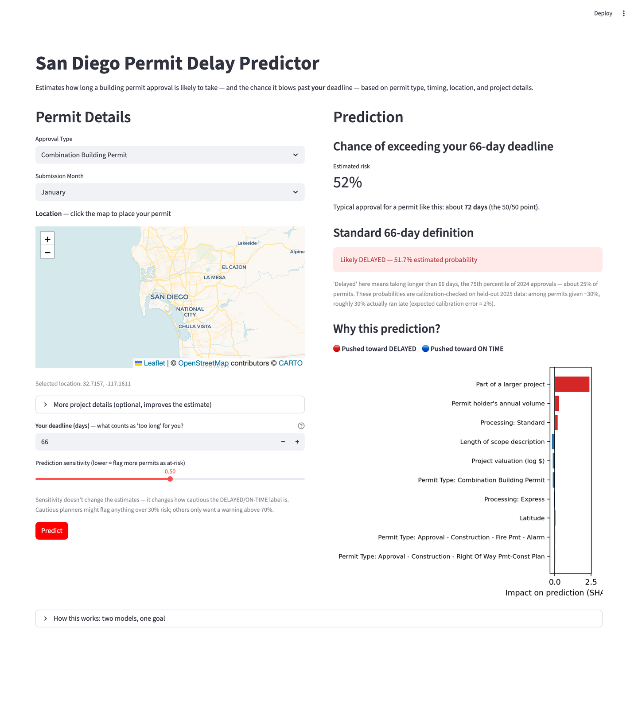
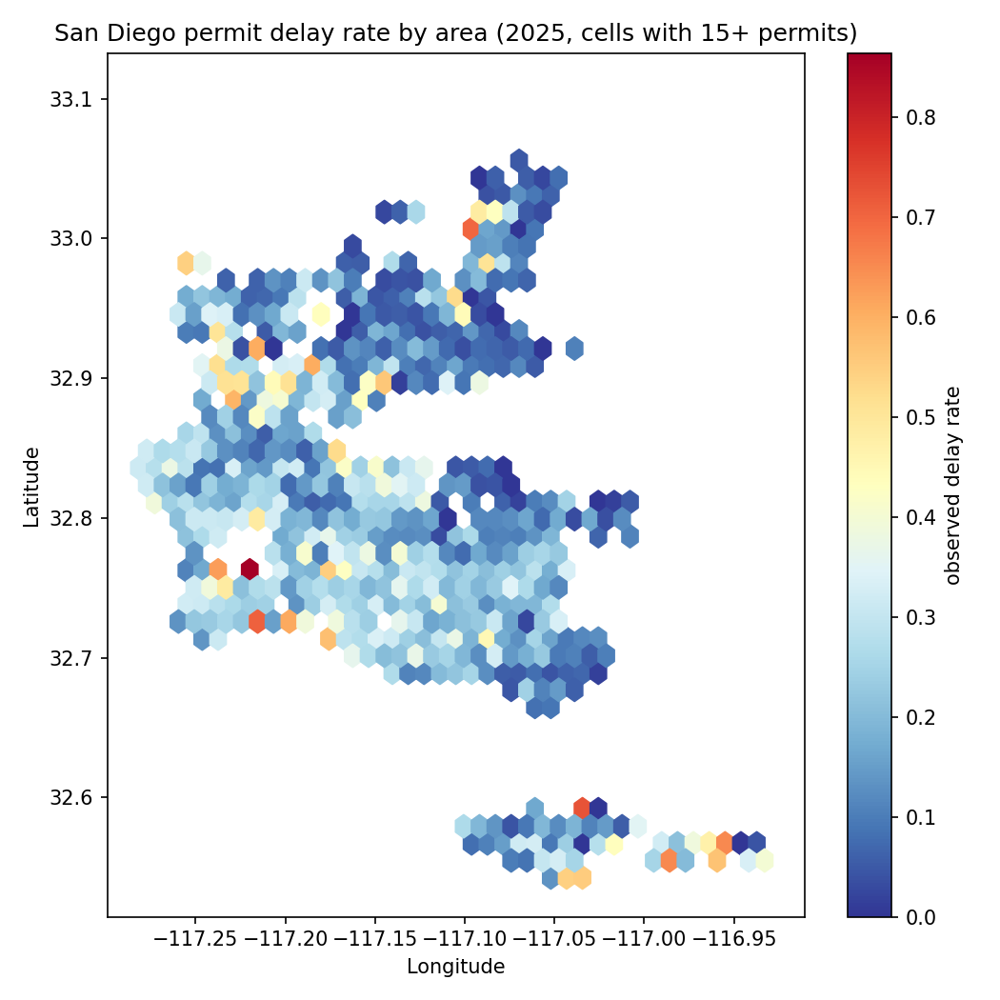
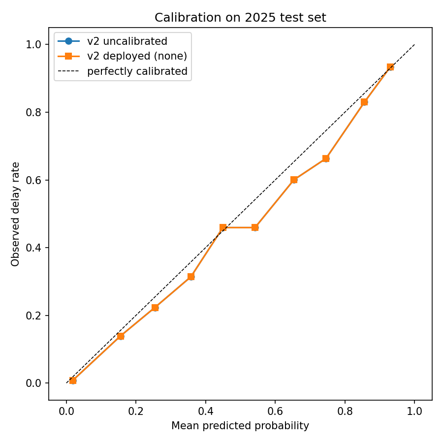
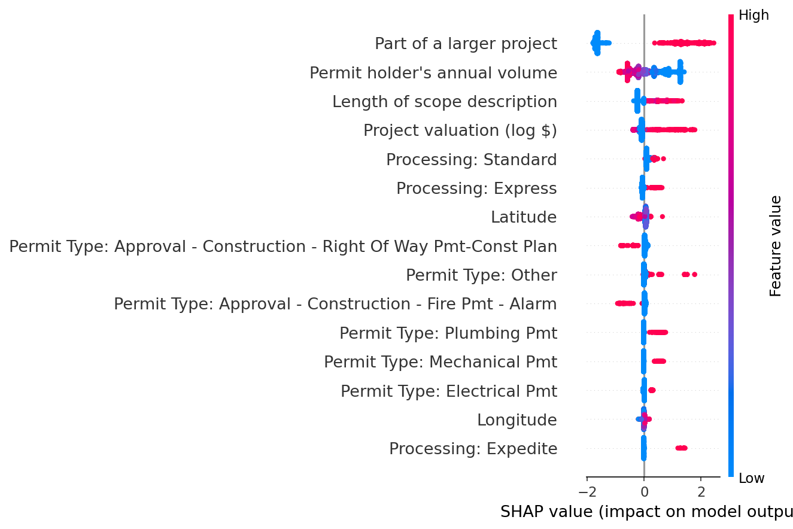

# San Diego Permit Delay Predictor

Predicting and explaining San Diego building permit approval delays — including the chance a permit blows past *your* deadline — using gradient boosting and SHAP, built on the City of San Diego's open permit dataset.

**[Live App](https://sd-permit-delays.streamlit.app) · [v2 Analysis Notebook](analysis_v2.ipynb) · [Training Pipeline](train.py) · [Decision Log](DECISIONS.md) · [Error Analysis](reports/error_analysis.md)**

[](https://sd-permit-delays.streamlit.app)

## Overview

The City of San Diego's Development Services Department processes tens of thousands of permit approvals a year, everything from homeowner renovations to large residential developments. Some permits move in days, others sit for months. This project predicts whether a given permit is likely to be delayed, estimates the risk against any user-chosen deadline, and explains *why* using SHAP per-prediction breakdowns.



## Key Findings

- **Whether a permit requires plan review dominates everything else.** Full-review types (Combination Building, Building, Electrical/Plumbing/Mechanical) run 62-75% delayed; routine no-plan types run under 1%.
- **Project context is powerful and was hiding in sparse columns**: being linked to a larger development project (1% vs 62% delay rate), the processing track (0.1%-95% across categories), and declared valuation all carry major signal despite low coverage.
- **Who pulls the permit matters**: high-volume contractors (100+ permits/yr) run 5.6% delayed vs 38% for first-time applicants.
- Submission month has a modest effect; location is real but small and continuous.

## Data

- Source: [City of San Diego Open Data Portal](https://data.sandiego.gov/datasets/development-permits/) — "Approvals for development projects"
- 2024 data for training (~53K approvals after cleaning), 2025 as a held-out test set (~53K), split by year to simulate real deployment and avoid leakage
- Binary target: approval taking longer than the 75th percentile of 2024 (66 days)
- All features screened for submission-time availability; post-decision columns (close/expire dates, status) excluded as leakage (see [DECISIONS.md](DECISIONS.md))

## Models

Everything is reproducible via `python train.py`, which regenerates all artifacts and figures from the raw CSVs.

**1. Binary delay classifier** (`GradientBoostingClassifier`, 39 features):

| Metric | v1 (type+month+location) | v2 (+ project context) |
|---|---|---|
| Accuracy | 85.1% | **87.3%** |
| Precision | 65.7% | **69.3%** |
| Recall | 74.9% | **80.6%** |
| ROC-AUC | 0.916 | **0.942** |

(Naive always-on-time baseline: 76.9% accuracy on 2025.)

**2. Deadline risk curve** — a grid of classifiers at 15/30/45/66/90/120/180 days, interpolated so the app can answer "what's the chance this exceeds *my* deadline?" for any threshold. This replaced a quantile-regression attempt that failed on the zero-inflated duration distribution — the full post-mortem is in [DECISIONS.md](DECISIONS.md).

**3. Calibration, checked and deliberately not applied**: isotonic/sigmoid wrappers made things *worse* under temporal shift (selected on a held-out late-2024 slice, never the test set). The raw model is already well-calibrated on 2025 (ECE ≈ 2.3%), so predicted probabilities can be taken at face value.



## Where the model is wrong

Honest error analysis on 2025 ([full report](reports/error_analysis.md)):

- Near-perfect on routine no-plan types; catches 91-96% of delays on classic plan-review types.
- **Two real blind spots**: Right-of-Way permits (38% delay rate, only 11.5% recall) and Fire Alarm permits (22% delay rate, 11% recall) — delay in these types isn't explained by the current features.
- Misses skew toward shorter delays (median 148 days among misses vs 192 overall); errors are flat across months and geography.

## Explainability

SHAP `TreeExplainer` provides global importances and per-prediction breakdowns in the app.



## App

The [Streamlit dashboard](https://sd-permit-delays.streamlit.app) lets users describe a hypothetical permit (type, month, clickable map location, optional project details) and see:

- The chance approval exceeds **their own deadline** (any number of days)
- A typical-wait estimate and the standard 66-day delayed/on-time call with probability
- A SHAP chart explaining which factors drove that specific prediction

To run locally:
```bash
pip install -r requirements.txt
python train.py        # only needed once, regenerates model artifacts
streamlit run app.py
```

## Tech Stack

Python, Pandas, scikit-learn, SHAP, Streamlit, streamlit-folium, Matplotlib

## Project Structure

```
sd-permit-delays/
├── analysis_v2.ipynb       # Narrated v2 analysis: features, calibration, deadlines, errors
├── eda.ipynb               # Original v1 exploration: cleaning, features, modeling, SHAP
├── train.py                # Reproducible pipeline: data -> models + figures
├── features.py             # Shared feature engineering (training AND serving)
├── error_analysis.py       # Generates reports/error_analysis.md + maps
├── app.py                  # Streamlit dashboard
├── DECISIONS.md            # Log of key project decisions and reasoning
├── reports/                # Error analysis writeup
├── figures/                # Calibration, SHAP, coverage, maps, metrics.json
├── *.pkl                   # Model artifacts (see train.py)
└── data/                   # Raw CSVs (not tracked in git, see .gitignore)
```
